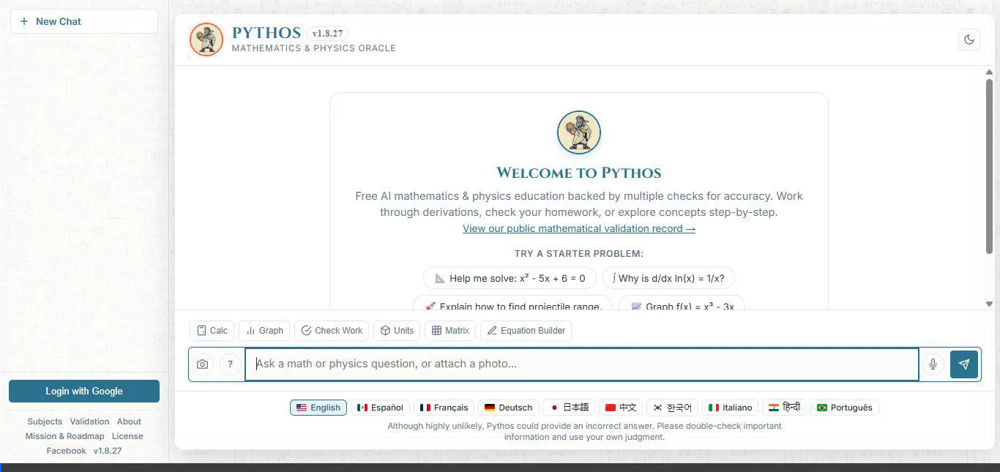
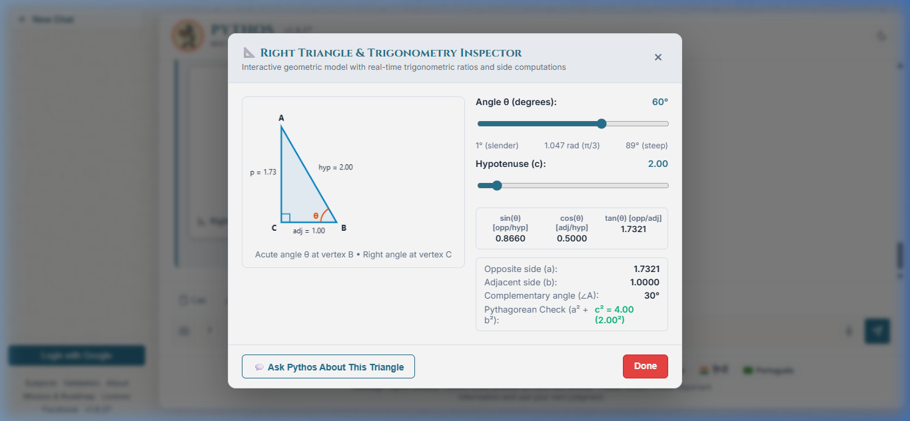
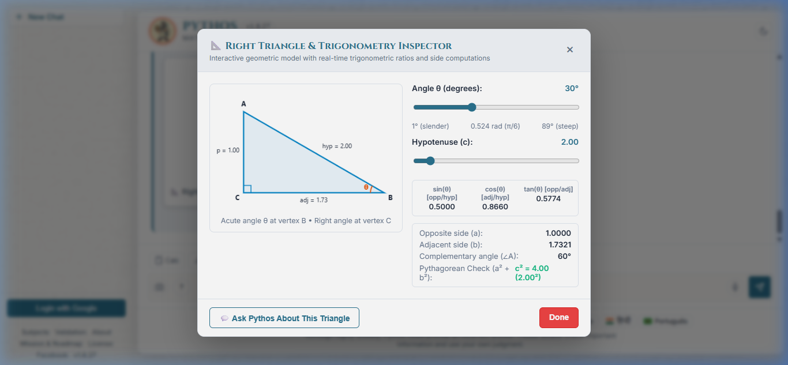
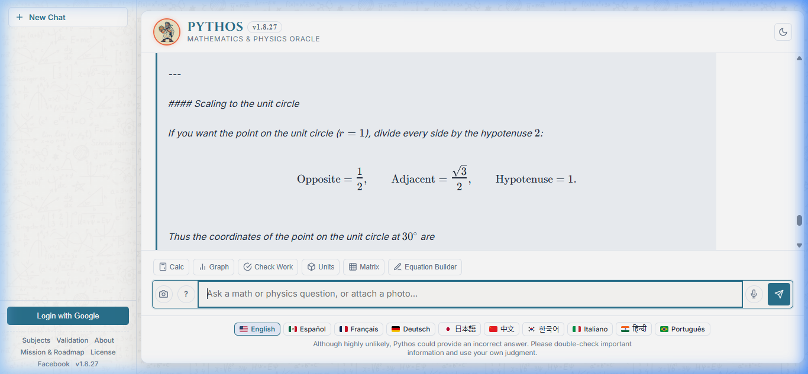
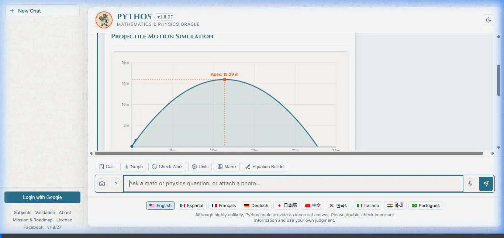
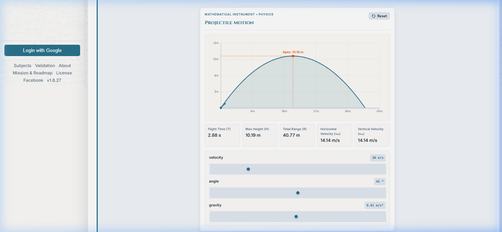

# Pythos

[Pythos](https://pythos.lanzar.me/) is a free AI mathematics and physics tutor built by [LANZAR](https://lanzar.me/) to help students master STEM concepts with rigor, clarity, and confidence. Functioning as a **free AI tutor**, **AI mathematics tutor**, and **AI physics tutor**, Pythos emphasizes conceptual understanding over simple answer generation.

---

## Overview

Traditional chatbots frequently produce unchecked mathematical output or offer quick shortcuts that bypass the learning process. Pythos takes a fundamentally different pedagogical approach: it actively guides learners through problem-solving steps, verifies derivations against deterministic calculation safeguards, and helps students build genuine intuition.

Whether working through algebra, calculus, or classical mechanics, Pythos provides a dedicated learning environment accessible to any student.

## Key Features

- **Step-by-Step Tutoring:** Provides structured, step-by-step guidance and progressive hints that lead students through derivations without simply handing them the answers.
- **Reasoning Verification:** Audits algebraic manipulations, calculus derivations, and physical formulas using deterministic calculation kernels and independent Computer Algebra System (CAS) verification to prevent mathematical hallucinations.
- **Interactive Math & Physics Visualizations:** Generates dynamic visual models—including 2D function graphs, projectile trajectories, force diagrams, and physical simulations—to help learners visualize abstract equations and relationships.
- **Study Guides & Reference Materials:** Includes curated, built-in study guides covering high school through undergraduate topics in algebra, calculus, and Newtonian mechanics.
- **Free & Accessible:** Fully free to use with no subscriptions or paywalls, built with dedicated accessibility considerations including assistive MathML support, screen-reader polite live regions, and keyboard-navigable tools.

## 📐 Live Visual Demonstrations: "Draw It Out First!"

Pythos features real-time, interactive geometric instruments and universal visual inspectors directly in the conversational canvas. When working through trigonometric reference angles, calculus derivatives, or coordinate geometry, Pythos automatically renders verified visual models that students can manipulate dynamically.

### Interactive Right Triangle & Trigonometry Inspector Demo

*Direct Video Downloads & Live URLs:* [MP4 Video (YouTube-ready)](https://pythos.lanzar.me/assets/demo/pythos-trig-demo.mp4) | [WebP Animation](https://pythos.lanzar.me/assets/demo/pythos-trig-demo.webp)

#### Key Demonstration Milestones:

1. **Interactive Geometric Model Card & Modal Inspector:**  
   Pythos proactively illustrates reference triangles with side lengths, angle indicators, and exact trigonometric ratios. Students can click **`📐 Geometric Model ↗`** to launch the full-screen interactive inspector workspace:  
     
   *Direct URL: [https://pythos.lanzar.me/assets/demo/trig-inspector-modal.png](https://pythos.lanzar.me/assets/demo/trig-inspector-modal.png)*

2. **Real-Time Dynamic Slider Recalculation:**  
   Adjusting the angle slider dynamically recalculates the canvas triangle geometry, side dimensions ($a, b, c$), and exact trigonometric functions ($\sin, \cos, \tan$) in real time:  
     
   *Direct URL: [https://pythos.lanzar.me/assets/demo/trig-inspector-30deg.png](https://pythos.lanzar.me/assets/demo/trig-inspector-30deg.png)*

3. **Socratic Follow-Up & Typeset Mathematical Solutions:**  
   Clicking **`💬 Ask Pythos About This Triangle`** transitions seamlessly back to the AI tutor for step-by-step Socratic breakdown and fully-typeset KaTeX mathematical derivations:  
     
   *Direct URL: [https://pythos.lanzar.me/assets/demo/pythos-math-response.png](https://pythos.lanzar.me/assets/demo/pythos-math-response.png)*

### 🚀 Classical Physics & Ballistics Simulator (Projectile Motion)

When a student asks to simulate or solve 2D kinematics problems (e.g. *"Simulate projectile motion"* or *"A ball is thrown at 20 m/s at 45°"*), Pythos mounts a classical physics instrument directly in the dialogue:

*Direct Video Downloads & Live URLs:* [MP4 Video with Ambient Music (YouTube-ready)](https://pythos.lanzar.me/assets/demo/pythos-physics-demo.mp4) | [WebP Animation](https://pythos.lanzar.me/assets/demo/pythos-physics-demo.webp)

*Direct URL: [https://pythos.lanzar.me/assets/demo/projectile-physics-sim.png](https://pythos.lanzar.me/assets/demo/projectile-physics-sim.png)*

#### Simulator Capabilities:
- **Real-Time Trajectory Tracing:** Dynamic 2D canvas plots the parabolic trajectory, apex height marker, and ground impact coordinates.
- **Dynamic Physics Controls:** Classical sliders for Launch Velocity ($v_0$), Launch Angle ($\theta$), and Gravitational Acceleration ($g$).
- **Etched Metric Tablets:** Instantaneous recalculation of Flight Time ($T$), Maximum Height ($H$), Total Range ($R$), and orthogonal velocity vectors ($v_{0x}, v_{0y}$).
- **High-Arc vs Flat Ballistics:** Real-time trajectory morphing and comparison (e.g. steep angles with increased apex vs shallow long-range arcs).

## Live Application

Try Pythos online:  
👉 **[https://pythos.lanzar.me/](https://pythos.lanzar.me/)**

## Development & Support

Pythos is an independent education initiative created by Jon Scott and developed and supported by **[LANZAR](https://lanzar.me/)** to provide open, reliable, and rigorous educational tools for students everywhere. Pythos is being developed toward nonprofit educational operation with a simple principle: no kid should be charged to learn.

---

*For engine release notes and milestone history, see [CHANGELOG.md](CHANGELOG.md).*
